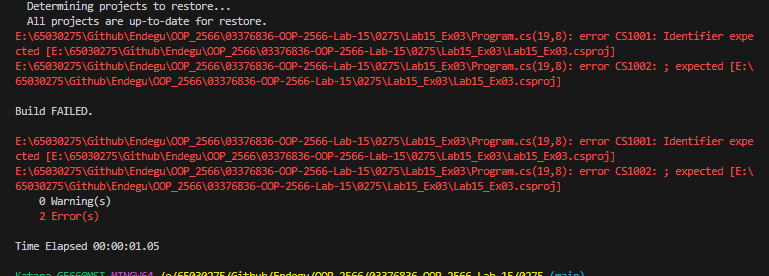
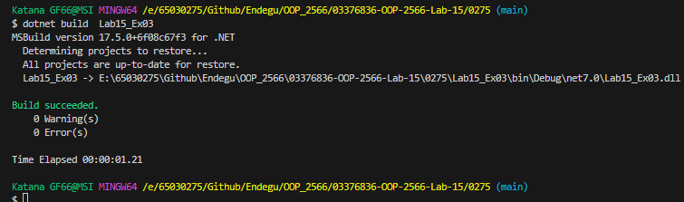

class InstanceMethod
{
    public void MethodA(string message)
    {
        System.Console.WriteLine($"You are calling instance MethodA() with message {message}");
    }
}

static class StaticMethod
{
    public static void MethodB(string message)
    {
        System.Console.WriteLine($"You are calling static MethodB() with message {message}");
    }
}

public delegate void MyDelegate(string message);

class Program
{
    static void Main(string[] args)
    {
        var im = new InstanceMethod();
        MyDelegate del = im.MethodA;
        InvokeDelegate(del);

        del = StaticMethod.MethodB;
        InvokeDelegate(del);

        del = (string message) => System.Console.WriteLine($"You are calling anonymous method with message {message}");
        InvokeDelegate(del);
    }

    static void InvokeDelegate(MyDelegate myDel)
    {
        myDel("Hello World");
    }
}
เมท็อด InvokeDelegate จะรับ Delegate เป็นพารามิเตอร์ และเรียกใช้งาน Delegate 